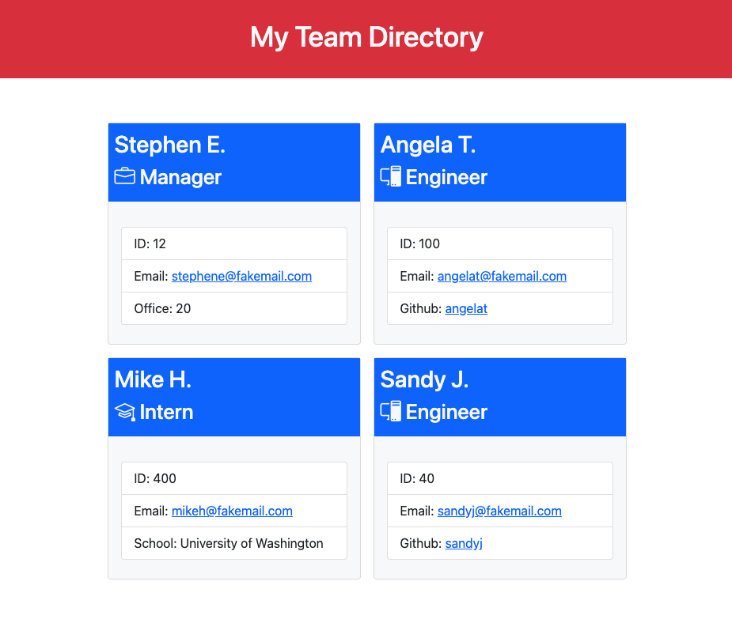

# 🛗 team-profile-generator
A node.js script to ask about members of a team that generates a profile website. This script assumes that there is one manager and any number of engineers or interns.

View a video of how to run the application [here](https://drive.google.com/file/d/1ollVVUod9U-qHPQVI7AvsfyzGeoMcito/view?usp=sharing)

## NPM Scripts
The application has these npm commands available
### `npm install`
After cloning the code locally, be sure to run `npm install` to get all of the dependencies for running the code and tests.
### `npm start`
To start the index.js on the command line and start collecting the data about the team.
### `npm run test`
To start the jest tests.

## Libraries
* jest
* inquirer
* node.js
* Bootstrap
